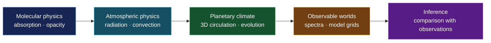

# OASIS Planetary Climate Physics

### Building virtual worlds that follow universal laws of physics

**From molecular absorption to global climate—and from simulated worlds to telescope observations.**

[Project website](https://www.software-oasis.com) · [Public resources](https://github.com/OASIS-Team-UoS/oasis-public) · [Grid explorer](https://github.com/OASIS-Team-UoS/oasis-grid)

---

## Our scientific goal

How do the same physical laws produce the extraordinary diversity of planetary atmospheres and climates?

At the University of Southampton, we are developing **OASIS**: an ecosystem of numerical models that connects the physics of molecules and radiation to atmospheric structure, three-dimensional circulation, planetary spectra and observations.

Our goal is to construct physically consistent virtual planets. These worlds allow us to investigate environments across the Solar System and beyond, test how climate emerges from fundamental processes, and interpret planets that we can observe but cannot visit.

> **One physical framework, many possible worlds.**
>
> OASIS is designed to follow the chain from microscopic radiative interactions to planetary-scale climate and observable signatures.

## A connected hierarchy of planetary models

The hierarchy is modular: researchers can study an individual process or connect components into a wider experiment. Versioned physical data and documented model outputs provide the links between stages.

## The OASIS ecosystem

| | Component | Scientific role |
|:---:|---|---|
| 🌍 | **OASIS** | Simulates atmospheric dynamics and climate across a three-dimensional planetary globe. |
| 🌡️ | **OASIS-1D** | Studies radiative-convective equilibrium, atmospheric structure and column physics. |
| 🔬 | **OASIS-XS** | Produces molecular cross-sections, opacities and correlated-k data for radiative-transfer calculations. |
| 🔭 | **OASIS-Retriever** | Connects simulated spectra and model grids with observations through atmospheric inference. |

Together, the components support a traceable scientific path:

**molecular data → radiative heating and cooling → atmospheric structure → global circulation → spectra → interpretation of observations**

## Questions we want to explore

- How do atmospheric composition, stellar radiation and planetary properties shape climate?
- Which physical processes control circulation, heat redistribution and climate stability?
- How do clouds, radiation and dynamics interact across different planetary regimes?
- What observable signatures distinguish different atmospheric states?
- How can climate-model predictions help interpret remote observations of planets?

These questions span terrestrial planets, giant planets and exoplanets. Individual studies may use different parts of the modelling hierarchy depending on the scientific problem.

## Foundation

The ecosystem is being advanced through **Foundation — “Building Virtual Worlds that Follow Universal Laws of Physics”**, a University of Southampton research programme supported by the Horizon Europe Guarantee:

| | |
|---|---|
| **Project reference** | EP/Z00330X/1 |
| **Funded period** | September 2024–September 2029 |
| **Research programme** | Foundation |
| **Software ecosystem** | OASIS |

Foundation develops the research programme, scientific collaborations and shared vision. OASIS is the software ecosystem through which that research is implemented.

## Explore and follow the work

- **[Discover the project](https://www.software-oasis.com)** — scientific context, visualisations and project news.
- **[Browse public OASIS resources](https://github.com/OASIS-Team-UoS/oasis-public)** — approved public information and release materials.
- **[Explore the planetary grid](https://github.com/OASIS-Team-UoS/oasis-grid)** — an interactive view of the OASIS grid.

---

**OASIS is under active scientific development.**

Components are shared publicly as they become validated, documented and approved for release. Listing a component here does not imply that its source is currently public or production-ready.

